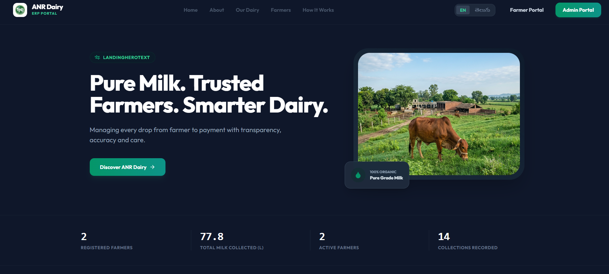
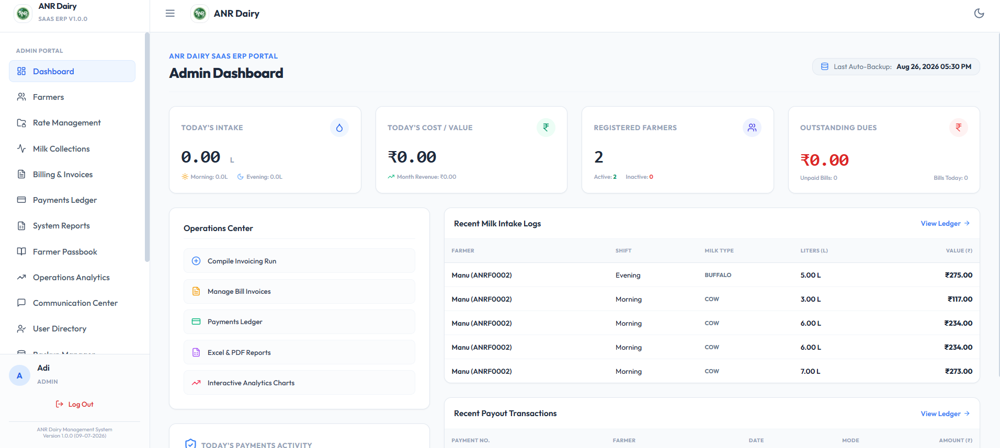
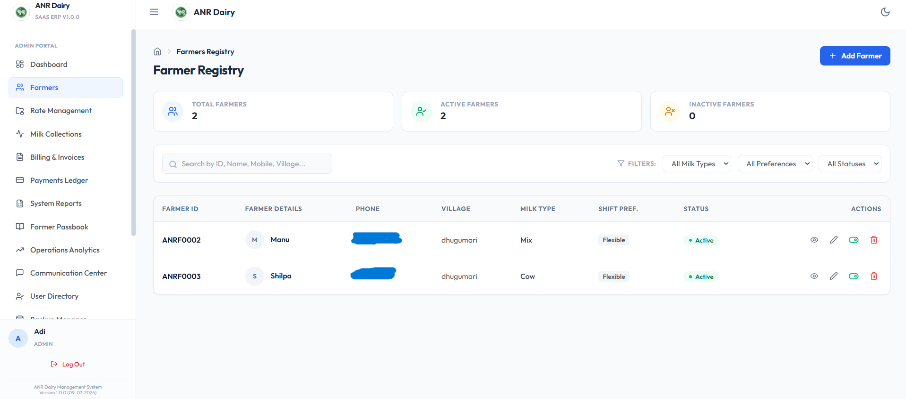
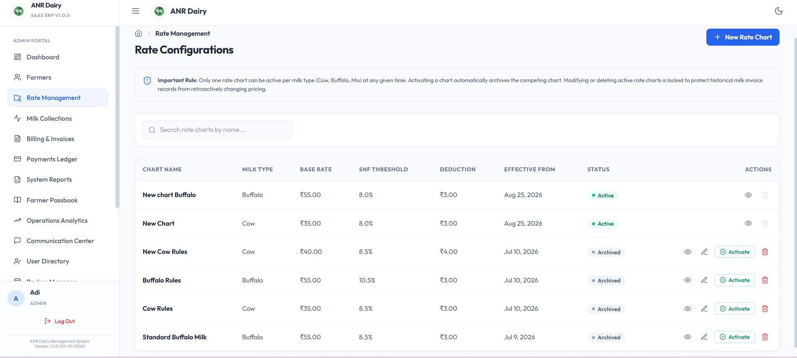
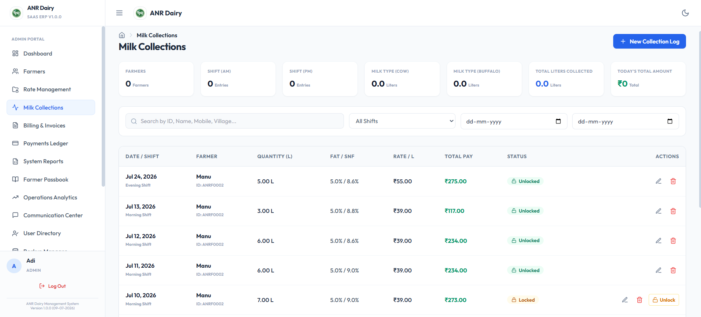
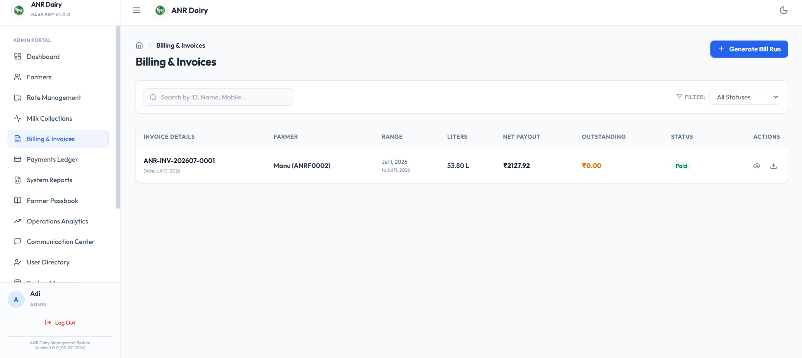
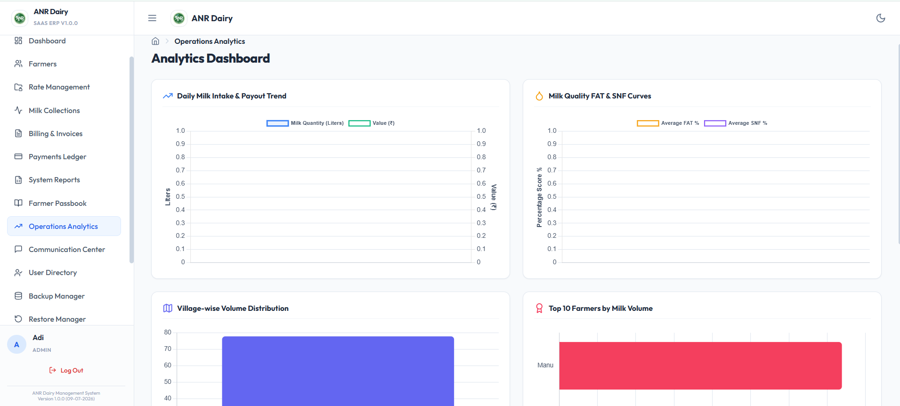

# 🥛 ANR Dairy Management System

> A full-stack **MERN-stack dairy management platform** developed for ANR Dairy to digitize and streamline daily dairy operations.

ANR Dairy Management System centralizes farmer management, milk collection, rate calculation, billing, payments, invoicing, notifications, reporting, and operational management into a single web application.

The system is designed around the operational requirements of **ANR Dairy, a dairy business with 25 years of experience**, with dedicated workflows for administrators, employees, and farmers.

---

## 🌐 Live Application

## 🌐 Live Application

🚀 **[Open Live Frontend](https://anr-dairy-management-system.vercel.app/)**

🔧 **[Backend API](https://anr-dairy-management-system.onrender.com/)**

❤️ **[API Health Check](https://anr-dairy-management-system.onrender.com/health)**

---

## 📌 Project Overview

The ANR Dairy Management System replaces fragmented manual dairy record management with a centralized digital platform.

The application provides dedicated workflows for:

- 👨‍💼 **Administrators**
- 👷 **Employees**
- 👨‍🌾 **Farmers**

The platform helps manage farmer records, daily milk collections, configurable rate charts, billing periods, invoices, payments, notifications, reports, and system operations from one centralized application.

---

## ✨ Key Features

### 👨‍💼 Admin Portal

- Admin dashboard
- Farmer registration and management
- Farmer details and passbook
- Employee and user management
- Milk collection management
- Rate chart creation and management
- Rate chart history
- Rate chart deletion
- Billing management
- Invoice generation and management
- Payment tracking
- Reports and analytics
- Communication center
- Notification management
- System settings
- Security settings
- Backup and restore management

### 👷 Employee Portal

- Employee authentication
- Employee dashboard
- Farmer selection
- Daily milk collection entry
- Collection management
- Shift history
- Operational collection workflows

### 👨‍🌾 Farmer Portal

- Secure farmer authentication
- Farmer dashboard
- First-time login support
- Password management
- Farmer profile
- Milk collection history
- Farmer passbook
- Payment information
- Notifications

---

## 🥛 Milk Collection Management

The system provides a structured workflow for recording and managing daily milk collections.

### Features

- Farmer-wise milk collection
- Daily collection records
- Morning and evening collection support
- Cow and buffalo milk management
- Milk quantity recording
- Collection history
- SNF-based pricing
- Collection records linked to individual farmers
- Collection reporting
- Printable collection reports

---

## 💰 Rate Chart Management

The rate management module allows administrators to configure and maintain dairy pricing.

### Features

- Create rate charts
- View rate charts
- Edit rate charts
- Activate and deactivate rate charts
- Effective-date based pricing
- Rate chart history
- Delete old rate charts
- SNF-based pricing
- Configurable milk rates
- SNF values starting from **8.0**

---

## 🧾 Billing & Invoice Management

The billing module helps streamline farmer payment calculations and invoice management.

### Features

- Custom billing periods
- Farmer-wise billing
- Milk collection-based billing
- Invoice generation
- Invoice details
- Invoice history
- Printable invoices
- Payment tracking
- Farmer passbook
- Payment history

---

## 💳 Payment Management

The payment module provides centralized tracking of farmer payments.

- Payment records
- Farmer-wise payment history
- Payment status tracking
- Payment details
- Passbook integration
- Payment reports
- Printable payment records

---

## 🔔 Notifications & Communication

The communication module provides centralized notification functionality.

### Features

- Notification templates
- Notification logs
- Farmer notifications
- Communication center
- SMS service integration
- WhatsApp service integration
- Notification history

---

## 📊 Reports & Analytics

The system provides operational visibility through reporting and analytics.

### Reports include

- Milk collection reports
- Farmer reports
- Payment reports
- Billing reports
- Invoice information
- Monthly reports
- Passbook reports
- Operational analytics
- Printable reports

---

## 🔐 Authentication & Security

Security is implemented across the frontend and backend.

### Security features

- JWT-based authentication
- Role-based access control
- Protected API routes
- Authentication middleware
- Session management
- Password validation
- Password change workflows
- Access control
- Security settings
- Session timeout handling
- Error handling
- Unauthorized-access handling

Sensitive configuration is managed through environment variables and excluded from version control.

---

## 💾 Backup & Recovery

The backend includes backup and recovery functionality to help protect application data.

### Features

- Manual backup support
- Scheduled backup support
- Backup logs
- Restore management
- Database integrity checking
- Backup history

Local database backup files are intentionally excluded from the GitHub repository.

---

## 🌐 Multilingual Support

The frontend includes localization support for:

- 🇬🇧 English
- 🇮🇳 Telugu

The localization structure allows additional languages to be added in the future.

---

## 🛠️ Technology Stack

This project is built using the **MERN stack**.

### MERN Stack

| Technology | Purpose |
|---|---|
| **MongoDB** | NoSQL database for application data |
| **Express.js** | Backend web framework and REST API layer |
| **React** | Frontend user interface |
| **Node.js** | Backend JavaScript runtime |

### Frontend

- React
- Vite
- JavaScript
- Tailwind CSS
- Axios
- i18n / localization

### Backend

- Node.js
- Express.js
- Mongoose
- JWT Authentication
- REST APIs

### Development Tools

- Git
- GitHub
- MongoDB Database Tools
- VS Code

### Deployment

- **Frontend:** Vercel
- **Backend:** Render
- **Database:** MongoDB Atlas

---

## 🏗️ System Architecture

```text
                    ANR Dairy Management System

                              │
             ┌────────────────┼────────────────┐
             │                │                │
           Admin           Employee          Farmer
           Portal           Portal           Portal
             │                │                │
             └────────────────┼────────────────┘
                              │
                              ▼
                       React Frontend
                              │
                         Vercel Hosting
                              │
                              ▼
                          REST APIs
                              │
                              ▼
                      Node.js + Express
                              │
                         Render Hosting
                              │
                              ▼
                       MongoDB Atlas
                          Database
## 🔄 Core Application Workflow

```text
Farmer Registration
        ↓
Milk Collection
        ↓
Rate Chart Calculation
        ↓
Billing Period
        ↓
Invoice Generation
        ↓
Payment Processing
        ↓
Farmer Passbook
        ↓
Reports & Analytics
```

---

## 📁 Project Structure

```text
ANR-Dairy-Management-System/
│
├── backend/
│   ├── config/
│   ├── controllers/
│   ├── middleware/
│   ├── models/
│   ├── routes/
│   ├── services/
│   ├── utils/
│   ├── .env.example
│   ├── package.json
│   └── server.js
│
├── frontend/
│   ├── public/
│   ├── src/
│   │   ├── assets/
│   │   ├── components/
│   │   ├── context/
│   │   ├── locales/
│   │   ├── pages/
│   │   └── services/
│   ├── package.json
│   └── vite.config.js
│
├── docs/
│   ├── screenshots/
│   ├── ADMINISTRATOR_MANUAL.md
│   ├── API_DOCUMENTATION.md
│   ├── DEPLOYMENT_GUIDE.md
│   ├── INSTALLATION_GUIDE.md
│   ├── SYSTEM_DIAGRAMS.md
│   └── USER_MANUAL.md
│
├── .gitignore
├── README.md
└── ...
```

---

## 👥 User Roles

| Role | Main Responsibilities |
|---|---|
| **Admin** | Manage farmers, collections, rates, billing, invoices, payments, reports, notifications, backups, and system settings |
| **Farmer** | View milk collections, passbook, payments, profile, and notifications |

---

## 📚 Documentation

Detailed documentation is available in the `docs/` directory.

| Document | Description |
|---|---|
| `ADMINISTRATOR_MANUAL.md` | Administrator functionality and workflows |
| `API_DOCUMENTATION.md` | Backend REST API documentation |
| `DEPLOYMENT_GUIDE.md` | Deployment instructions |
| `INSTALLATION_GUIDE.md` | Local installation instructions |
| `SYSTEM_DIAGRAMS.md` | System architecture and diagrams |
| `USER_MANUAL.md` | Application usage guide |

---

## ⚙️ Local Development

### Prerequisites

- Node.js
- npm
- MongoDB
- Git

### Clone the repository

```bash
git clone https://github.com/kummetha-manaswi/ANR-Dairy-Management-System.git
cd ANR-Dairy-Management-System
```

### Backend

```bash
cd backend
npm install
npm run dev
```

### Frontend

Open another terminal:

```bash
cd frontend
npm install
npm run dev
```

The Vite development server will display the local frontend URL in the terminal.

---

## 🔑 Environment Variables

Create a `.env` file inside the `backend` directory.

Use:

```text
backend/.env.example
```

as the configuration template.

Example:

```env
MONGO_URI=
JWT_SECRET=
PORT=
```

Additional environment variables may be required for external communication services.

> ⚠️ Never commit real database credentials, passwords, JWT secrets, API keys, SMS credentials, or other sensitive information to GitHub.

---

## 🖼️ Application Screenshots

The following screenshots demonstrate the main workflows and user interfaces of the ANR Dairy Management System.

### 🏠 Landing Page



### 📊 Admin Dashboard



### 👨‍🌾 Farmer Management



### 💰 Rate Chart Management



### 🥛 Milk Collection



### 🧾 Billing & Invoices



### 📈 Reports & Analytics



---

## 🚀 Deployment

The application has been successfully deployed and is running in production.

### Production Architecture

```text
                         GitHub Repository
                                │
                    ┌───────────┴───────────┐
                    │                       │
                    ▼                       ▼
                 Vercel                  Render
              Frontend Hosting        Backend Hosting
                    │                       │
                    │                       ▼
                    │                 REST API
                    │                       │
                    └───────────┬───────────┘
                                │
                                ▼
                          MongoDB Atlas
                            Database
```

### Deployment Services

| Component | Platform |
|---|---|
| Frontend | Vercel |
| Backend | Render |
| Database | MongoDB Atlas |
| Source Code | GitHub |


Production credentials and environment variables are configured separately from the source code.

---

## 🔒 Security & Data Protection

- Authentication is protected using JWT.
- Role-based access controls restrict user functionality.
- Protected API routes prevent unauthorized access.
- Authentication endpoints use rate limiting.
- HTTP security headers are enabled.
- Sensitive credentials are stored using environment variables.
- Local database backups are excluded from version control.
- Production database credentials are not stored in the repository.
- Database backup and restore functionality is available through the backend.

> ⚠️ Production secrets and database credentials must never be committed to GitHub.

---

## 🔮 Future Enhancements

Although the core application is deployed and operational, future improvements may include:

- Enhanced analytics and visualization
- Advanced dairy reporting
- More real-time notification capabilities
- Expanded SMS integration
- Additional farmer communication channels
- Improved mobile responsiveness
- Performance optimization
- Additional localization support
- Automated cloud backup improvements
- Additional operational dashboards

---

## 🎯 Project Highlights

This project demonstrates practical experience with:

- MERN stack development
- React and Vite
- Node.js and Express.js
- MongoDB and Mongoose
- REST API development
- JWT authentication
- Role-based authorization
- Business logic implementation
- Dairy management workflows
- Milk collection management
- Rate calculation and management
- Billing and invoice systems
- Payment management
- Database backup and recovery
- Responsive frontend development
- Multilingual application support
- Git and GitHub
- Production deployment
- Vercel frontend hosting
- Render backend hosting
- MongoDB Atlas database hosting

---

## 📌 Project Status

### 🟢 Production Deployed & Operational

The ANR Dairy Management System has been successfully deployed with:

- ✅ React + Vite frontend
- ✅ Node.js + Express backend
- ✅ MongoDB Atlas production database
- ✅ JWT authentication
- ✅ Role-based access control
- ✅ Farmer management
- ✅ Milk collection
- ✅ Rate management
- ✅ Billing and invoices
- ✅ Payment management
- ✅ Notifications
- ✅ Reports and analytics
- ✅ Backup and recovery
- ✅ GitHub source control
- ✅ Vercel frontend deployment
- ✅ Render backend deployment
- ✅ Production API health check

---

## 👩‍💻 Developer

### Kummetha Manaswi

Full-stack developer and developer of the ANR Dairy Management System.

---

## 📄 License

This project is maintained as a personal/academic software project developed for ANR Dairy.