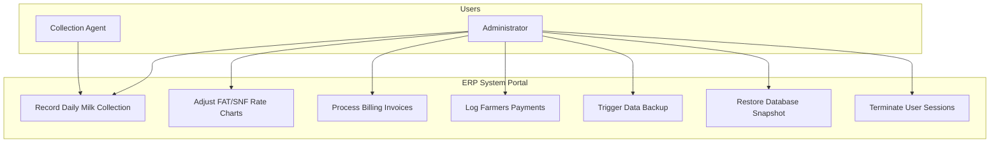
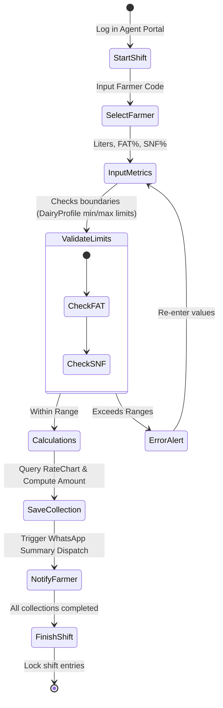
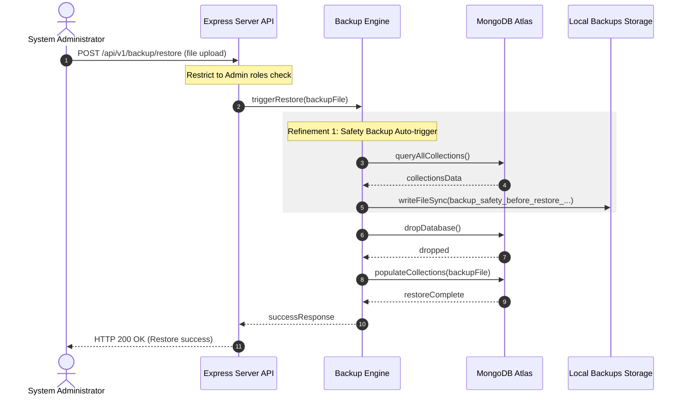
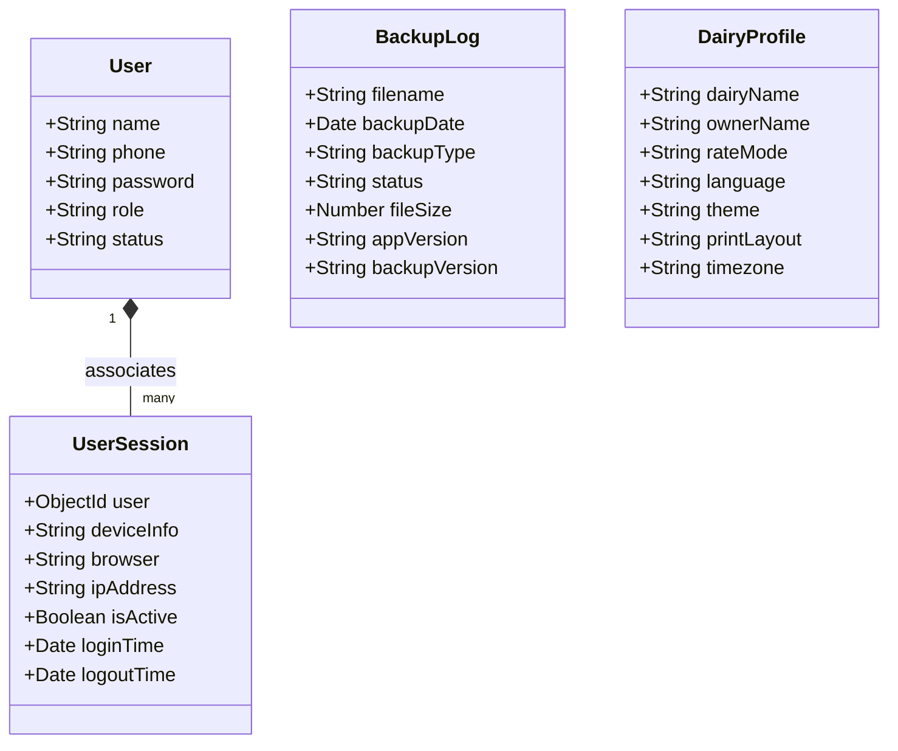
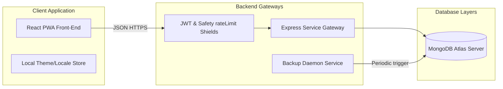
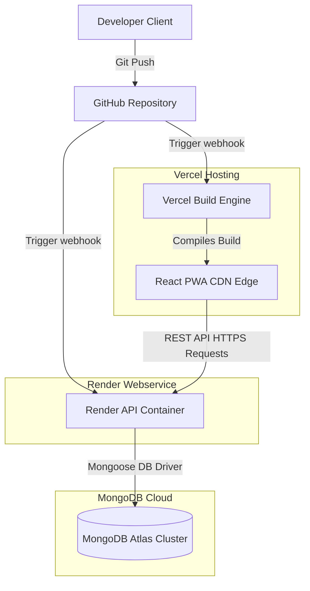

# System Architectural Diagrams - ANR Dairy System (v1.0.0)

This document contains Mermaid diagrams illustrating the structure, data models, and deploy workflows of the ANR Dairy Management System.

---

## 1. Entity Relationship (ER) Diagram

```mermaid
erDiagram
    USER ||--o{ USER-SESSION : maintains
    USER ||--o{ AUDIT-LOG : performs
    FARMER ||--o{ MILK-COLLECTION : supplies
    RATE-CHART ||--o{ MILK-COLLECTION : calculates
    MILK-COLLECTION ||--o| INVOICE : groups-into
    INVOICE ||--o| PAYMENT : clears
    FARMER ||--o{ INVOICE : receives
    FARMER ||--o{ PAYMENT : collects
    
    USER {
        ObjectId id PK
        string name
        string phone UNIQUE
        string passwordHash
        string role "admin | employee"
        string status "active | inactive | suspended"
    }

    FARMER {
        ObjectId id PK
        string farmerCode UNIQUE
        string name
        string phone
        string village
        string milkType "cow | buffalo"
        string status "active | inactive"
    }

    MILK-COLLECTION {
        ObjectId id PK
        ObjectId farmer FK
        date date
        string shift "morning | evening"
        number quantity
        number fat
        number snf
        number ratePerLiter
        number totalAmount
        ObjectId collectedBy FK
        ObjectId rateChartUsed FK
    }

    INVOICE {
        ObjectId id PK
        string invoiceNumber UNIQUE
        ObjectId farmer FK
        date startDate
        date endDate
        number totalLiters
        number netAmount
        string status "Draft | Generated | Paid | Cancelled"
    }
```

---

## 2. System Use Case Diagram



---

## 3. Shift Collection Activity Diagram



---

## 4. Backup & Restore Sequence Diagram



---

## 5. Database Schema Layout



---

## 6. System Architecture Diagram



---

## 7. Cloud Deployment Topology


